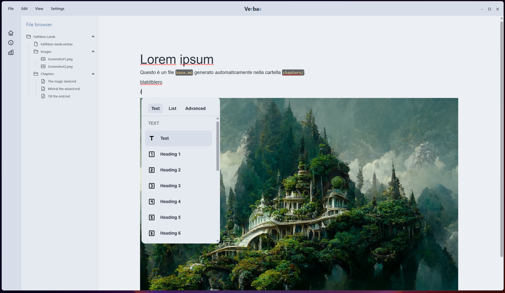

# Verbas AI



**Verbas AI** è un editor Markdown avanzato per la scrittura di **libri**, **guide**, **articoli** o **appunti**, progettato per offrire un'esperienza **moderna**, **reattiva** e **performante**.  
È sviluppato in **Rust** e **SolidJS**, con focus su velocità, chiarezza strutturale e architettura scalabile.

---

## 🙋‍♂️ Un progetto indipendente

Mi chiamo **Andrea**, sviluppatore Rust e SolidJS.  
**Verbas AI** nasce come una **challenge personale**: creare un'app desktop elegante, utile e ben progettata, interamente da solo, nel tempo libero.  
È un **esercizio tecnico e creativo** che sta evolvendo in un editor solido e funzionale per la scrittura professionale.

Il codice è open source e aperto a idee, feedback o future collaborazioni.

---

## 🧠 Obiettivo del progetto

Verbas AI vuole essere:

- ✍️ Un **editor fluido e potente**, ideale per contenuti lunghi e strutturati  
- 📄 Capace di esportare in **Markdown**, **PDF** e **ePub**  
- 🧱 Basato su un’**architettura modulare**, facilmente estensibile  
- 🧩 Progettato per supportare **plugin**, **temi**, modalità di lettura e **AI assistita**  

---

## 🗂️ Struttura dei progetti `.verbas`

Ogni progetto Verbas segue una struttura chiara e organizzata:

```
📁 nome-progetto/
├── base.md               # Documento principale in Markdown
├── project.verbas        # File di configurazione (JSON sotto il cofano)
└── chapters/             # (opzionale) Capitoli o contenuti suddivisi
    ├── intro.md
    ├── capitolo-1.md
    └── ...
```

> Il file `.verbas` contiene metadati, impostazioni e configurazioni del progetto.

---

## ✨ Funzionalità attualmente implementate

| Funzionalità                                | Stato |
|---------------------------------------------|-------|
| Creazione nuovo progetto `.verbas`          | ✅    |
| Apertura e parsing progetti `.verbas`       | ✅    |
| Salvataggio contenuto Markdown (`base.md`)  | ✅    |
| Salvataggio configurazione progetto         | ✅    |
| Clonazione progetto                         | ✅    |
| Parsing e pulizia frontmatter Markdown      | ✅    |
| Editor WYSIWYG Markdown (Milkdown)          | ✅    |
| Comunicazione backend Rust ↔ frontend JS    | ✅    |
| Riconoscimento editor pronto all’uso        | ✅    |

🗃️ È in fase di sviluppo anche il **supporto per esportazione in PDF e ePub**.

---

## 🛠️ Stack Tecnologico

| Tecnologia               | Ruolo                       | Motivazioni tecniche                            |
|--------------------------|------------------------------|--------------------------------------------------|
| 🦀 **Rust**              | Backend nativo (via Tauri)   | Sicuro, velocissimo, senza garbage collector     |
| 🧱 **Tauri**             | Framework desktop            | Leggero, sicuro, perfetto per app Rust+JS        |
| ⚛️ **SolidJS**          | Frontend reactive            | Reattività ultra-performante, architettura pulita|
| 🧪 **Milkdown**          | Editor Markdown WYSIWYG      | Output Markdown nativo, plugin-friendly          |
| 🎨 **Tailwind + DaisyUI**| Stile UI                     | Stile elegante, rapido da personalizzare         |
| ⚡ **Vite**              | Build system                 | Dev server istantaneo, perfetto per SolidJS      |

---

### 🔧 Perché Rust?

- 🏎️ **Velocità nativa** (compilato in codice macchina)  
- 🧱 **Memory safety** senza garbage collector  
- 🧮 **Strutture dati e parsing complessi** ben gestibili  
- 🧼 **Pulizia e robustezza architetturale**

Rust è perfetto per desktop apps, parsing, e manipolazione file affidabile e performante.

---

### ⚛️ Perché SolidJS?

- ⚡ **Reattività istantanea** con segnali (`createSignal`, `createStore`)  
- 🔍 **Controllo fine su DOM e stato**  
- 🧠 **Più semplice e veloce di React**, ma altrettanto espressivo  
- 📦 Perfetta integrazione con Vite, Tauri e Tailwind  

---

## 🧠 Dettaglio tecnico: Store e backend

### 🗂️ Store SolidJS

#### `projectStore.ts`

```ts
export const project = reactive<Project>({
  path: '',
  config: null,
});
```

#### `editorStore.ts`

```ts
const [editorInstance, setEditorInstance] = createSignal<Crepe | null>(null);
const [isEditorReady, setIsEditorReady] = createSignal(false);

export async function getMarkdown(): Promise<string | null> {
  const editor = editorInstance();
  if (!editor || !isEditorReady()) return null;
  try {
    // @ts-ignore
    return await editor.editor.action(ctx => ctx.get("doc"));
  } catch (e) {
    console.error("Errore leggendo dal context:", e);
    return null;
  }
}
```

---

### 🦀 Backend in Rust (comandi Tauri)

#### Caricamento Markdown

```rust
#[command]
pub fn load_markdown_file(path: String) -> Result<String, String> {
    std::fs::read_to_string(path).map_err(|e| e.to_string())
}
```

#### Salvataggio Markdown

```rust
#[command]
pub fn save_markdown_file(path: String, content: String) -> Result<(), String> {
    let mut file = File::create(&path).map_err(|e| format!("Failed to create file: {}", e))?;
    file.write_all(content.as_bytes()).map_err(|e| format!("Failed to write file: {}", e))?;
    Ok(())
}
```

#### Salvataggio file `.verbas`

```rust
#[command]
pub fn save_project(path: String, config: ProjectConfig) -> Result<(), String> {
    let json = serde_json::to_string_pretty(&config).map_err(|e| format!("Serialization error: {}", e))?;
    let mut file = File::create(&path).map_err(|e| format!("Failed to create file: {}", e))?;
    file.write_all(json.as_bytes()).map_err(|e| format!("Write error: {}", e))
}
```

---

## 🗺️ Roadmap

* [x] Setup progetto (Rust + Tauri + SolidJS)  
* [x] Supporto file `.verbas` (carica, salva, clona)  
* [x] Editor Milkdown integrato  
* [x] Gestione contenuti e struttura base  
* [ ] UI migliorata (sidebar, icone, theming)  
* [ ] Modalità lettura / “papiro mode” 
* [ ] Tema dark/light  
* [ ] Esportazione PDF / ePub  
* [ ] Supporto plugin e moduli  
* [ ] Modalità AI assistita  

---

## 📬 Contatti

Se vuoi seguire lo sviluppo, contribuire o anche solo dire "ciao":

* 🌐 [github.com/tuo-username](https://github.com/tuo-username)  
* 🐦 Twitter/X: *(aggiungi se vuoi)*  
* 📬 Apri una issue o una PR su GitHub!

---

> _“Verbas” deriva da **Verba** (parole), con una **R** e una **S** al centro: la mia piccola firma al mondo della scrittura digitale e del codice._